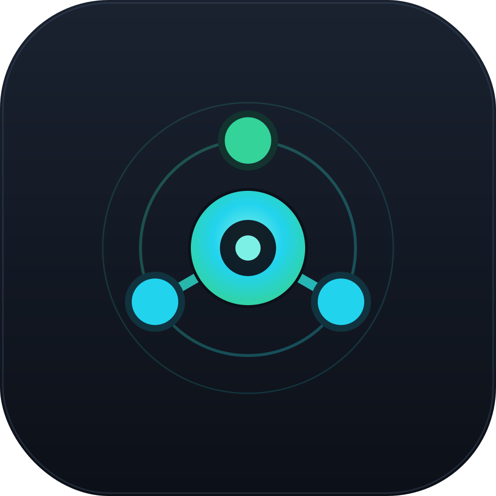
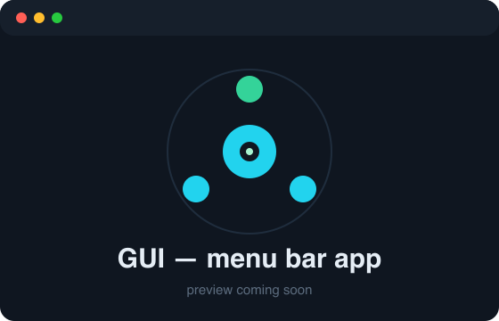
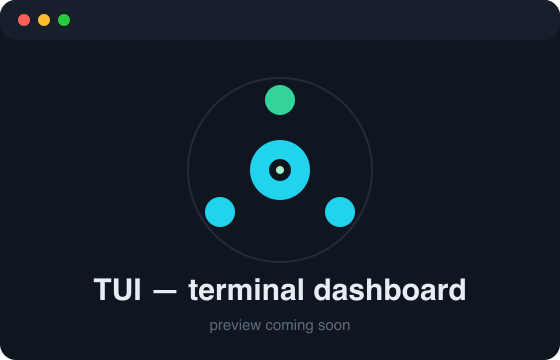
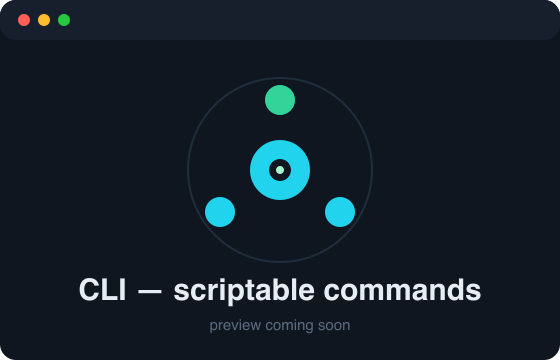

<p align="center">
  
</p>

<h1 align="center">Agent Hub</h1>

<p align="center"><em>Your mission control for AI coding agents — monitor Claude Code, Cursor, and Codex from your Mac's menu bar, terminal, or a TUI.</em></p>

[](https://github.com/xiaoleiy/agent-hub/actions/workflows/ci.yml)
[](https://github.com/xiaoleiy/agent-hub/releases)
[](https://github.com/xiaoleiy/agent-hub/stargazers)
[](https://github.com/xiaoleiy/agent-hub/network/members)
[](LICENSE)
[](#installation)

[](https://www.rust-lang.org/)
[](https://tauri.app/)
[](https://svelte.dev/)
[](https://kit.svelte.dev/)

---

## Why Agent Hub?

If you run AI coding agents all day, you probably juggle a few questions constantly: *Which agents are installed? Which account am I logged into? How close am I to my rate limit? Is my machine about to fall asleep mid-task?*

Agent Hub answers all of that in one place. It's a single, fast Rust binary that ships **three faces** — a native macOS menu-bar app, a rich terminal dashboard (TUI), and scriptable CLI commands — so you can check on your agents however you prefer to work. It watches your system, detects your agents, surfaces token usage and subscription limits, and can keep your Mac awake while long-running jobs finish.

Inspired by [steipete/CodexBar](https://github.com/steipete/CodexBar).

## Features

**System status**
- Live CPU, RAM, and uptime monitoring
- Network status at a glance
- Proxy / VPN detection
- Keep-alive via `caffeinate` to prevent sleep while agents run — with timed presets

**Agent intelligence**
- Auto-detects installed AI coding agents and their versions
- Shows the logged-in account (email / organization) per agent
- Tracks active sessions
- Reports token usage
- Surfaces subscription rate limits across rolling windows (5-hour and weekly)

**Three ways to use it**
- 🖥️ Native macOS menu-bar / desktop app (Tauri 2)
- 📊 Interactive terminal dashboard (ratatui)
- ⌨️ Scriptable CLI with `--json` output on every command

## Supported Agents

| Agent | Install / Version | Account (email/org) | Active Sessions | Token Usage | Rate Limits |
|-------------|:-----------------:|:-------------------:|:---------------:|:-----------:|:-----------:|
| Claude Code | ✅ | ✅ | ✅ | ✅ | ✅ |
| Cursor | ✅ | ✅ | ✅ | ✅ | ✅ |
| Codex | ✅ | ✅ | ✅ | ✅ | ✅ |

Rate limits are reported across rolling 5-hour and weekly subscription windows where the agent exposes them.

## Screenshots

| GUI (menu bar) | TUI (dashboard) | CLI (`status`) |
|:--:|:--:|:--:|
|  |  |  |
| Desktop app + system tray | Interactive ratatui dashboard | `--json`-friendly commands |

> Screenshots live in `docs/screenshots/`. Replace the placeholders above with real captures.

## Installation

> **macOS only** (10.15 Catalina or later).

### Homebrew (recommended)

```bash
brew tap xiaoleiy/tap
brew install --cask xiaoleiy/tap/agent-hub
```

This installs both the **GUI app** and the **`agent-hub` CLI**.

### Build from source

Requires a recent [Rust toolchain](https://rustup.rs/) and [Node.js](https://nodejs.org/).

```bash
git clone https://github.com/xiaoleiy/agent-hub.git
cd agent-hub
npm install
npm run tauri build
```

## Usage

Agent Hub is a single binary that routes by its arguments. Launch the GUI, drop into the TUI, or run one-off CLI commands.

### 🖥️ GUI

```bash
agent-hub          # launch the desktop app + system tray
agent-hub gui      # explicit form
```

A SvelteKit + Svelte 5 dashboard backed by Tauri 2, with a live menu-bar / tray presence.

### 📊 TUI

```bash
agent-hub tui
```

An interactive ratatui dashboard. Keybindings:

| Key | Action |
|-----|--------|
| `←` / `→` or `Tab` | Switch tabs |
| `1`–`9` | Jump to tab by number |
| `r` | Refresh |
| `w` | Cycle usage window |
| `Space` | Toggle keep-alive |
| `a` | Keep-alive for 30 minutes |
| `s` | Keep-alive for 1 hour |
| `d` | Keep-alive for 3 hours |
| `f` | Keep-alive forever |
| `q` / `Esc` | Quit |

### ⌨️ CLI

Every command supports `--json` for scripting and integration.

```bash
agent-hub status      # system overview: CPU, RAM, uptime, network, agents
agent-hub network     # network + proxy / VPN status
agent-hub agents      # detected agents, versions, and logged-in accounts
agent-hub sessions    # active agent sessions
agent-hub usage       # token usage and subscription rate limits
agent-hub keepalive   # manage caffeinate keep-alive
```

```bash
# Example: machine-readable usage data
agent-hub usage --json
```

## Architecture

```
agent-hub/
├── src/                          SvelteKit frontend
│   ├── routes/+page.svelte       dashboard
│   └── lib/components/*.svelte   UI components
└── src-tauri/
    └── src/
        ├── lib.rs                CLI / GUI router
        ├── cli/                  clap parsing + handlers
        ├── tui/                  ratatui dashboard
        ├── core_modules/         business logic
        │   ├── system            CPU / RAM / uptime
        │   ├── network           network status
        │   ├── keepalive         caffeinate wrapper
        │   ├── proxy             proxy / VPN detection
        │   └── agents/           claude · codex · cursor
        ├── commands/             Tauri IPC handlers
        └── models/               shared types
```

**Tech stack:** Rust (Tauri 2, ratatui 0.29, clap 4, rusqlite, reqwest, sysinfo 0.32, tokio, chrono) · SvelteKit 2 + Svelte 5 + Vite 6 + TypeScript.

## Development

```bash
# Install frontend dependencies
npm install

# Run the GUI in dev mode (hot reload)
npm run tauri dev

# Build the production app bundle
npm run tauri build
```

Run the CLI or TUI directly from source without building the app:

```bash
# CLI
cargo run --manifest-path src-tauri/Cargo.toml -- status
cargo run --manifest-path src-tauri/Cargo.toml -- usage --json

# TUI
cargo run --manifest-path src-tauri/Cargo.toml -- tui
```

Run the test suite:

```bash
cargo test --manifest-path src-tauri/Cargo.toml
```

## Contributing

Contributions are welcome and appreciated! Whether it's a bug report, a feature idea, a new agent integration, or a docs fix:

1. Open an issue to discuss larger changes.
2. Fork the repo and create a feature branch.
3. Make your change and run `cargo test` (and `npm run tauri build` if touching the GUI).
4. Open a pull request.

Friendly, focused PRs get merged fastest. Thanks for helping make Agent Hub better.

## Acknowledgements

Inspired by [steipete/CodexBar](https://github.com/steipete/CodexBar) — a great take on surfacing agent status in the macOS menu bar.

## License

Released under the [MIT License](LICENSE). © xiaoleiy.
